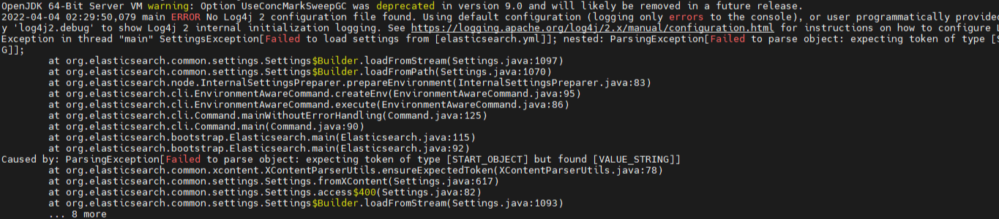

# 开发过程中遇到的问题

## 1. 关于阿里云OSS JDK更新问题
[链接](https://help.aliyun.com/zh/oss/developer-reference/oss-java-configure-access-credentials?spm=a2c4g.11186623.0.0.df1564fe8OHAaY#0cf90ff8b28eg)

### 使用RAM用户的AK

#### 环境变量

> 1.使用RAM用户AccessKey配置环境变量。

在CMD中运行以下命令。
```bash
setx OSS_ACCESS_KEY_ID "***********"
setx OSS_ACCESS_KEY_SECRET "***********"
```

运行以下命令，检查环境变量是否生效。
```bash
echo %OSS_ACCESS_KEY_ID%
echo %OSS_ACCESS_KEY_SECRET%
```
>2.参考上述方式修改系统环境变量后，请重启或刷新您的编译运行环境，包括IDE、命令行界面、其他桌面应用程序及后台服务，以确保最新的系统环境变量成功加载。

>3.使用环境变量来传递凭证信息。

```java
import com.aliyun.oss.common.auth.CredentialsProviderFactory;
import com.aliyun.oss.common.auth.EnvironmentVariableCredentialsProvider;

public class AkDemoTest {
    public static void main(String[] args) throws Exception {
        // 从环境变量中获取凭证
        EnvironmentVariableCredentialsProvider credentialsProvider =  CredentialsProviderFactory.newEnvironmentVariableCredentialsProvider();
        // 使用credentialsProvider进行后续操作...
        ClientBuilderConfiguration clientBuilderConfiguration = new ClientBuilderConfiguration();
        clientBuilderConfiguration.setSignatureVersion(SignVersion.V4);   
        // 创建OSSClient实例。
        OSS ossClient = OSSClientBuilder.create()
                .endpoint("endpoint")
                .credentialsProvider(credentialsProvider)
                .clientConfiguration(clientBuilderConfiguration)
                .region("region")
                .build();
                
        ossClient.shutdown();
    }
}
```

## 2. maven导入失败 aliyun-oss-spring-boot-starter

aliyun-oss-spring-boot-starter

解决方案 https://github.com/alibaba/aliyun-spring-boot/issues/40


## 3. Oss endpoint can‘t be empty

解决方案 https://huaweicloud.csdn.net/63876ef1dacf622b8df8c115.html


## 4. 数据库关系


## 5. product-attrupdate访问异常

在`router/index.js`中添加代码即可

```
{ path: '/product-attrupdate', component: _import('modules/product/attrupdate'), name: 'attr-update', meta: { title: '规格维护', isTab: true } }
```

## 6. docker安装ElasticSearch报错

> 报错：OpenJDK 64-Bit Server VM warning: Option UseConcMarkSweepGC was deprecated in version 9



OpenJDK 64-Bit Server VM warning: Option UseConcMarkSweepGC was deprecated in version 9.0 and will likely be removed in a future release.

主要是内存问题：
修改`jvm.options`文件
通过`find / -name jvm.options` 进行查找文件所在位置
进去修改`-Xms` 和 `-Xmx`为一下
`-Xms512m`
`Xmx512m`

如果你是看谷粒商城的话
那你创建es的挂载文件的时候要注意：
host: 和 0.0.0.0 中间是有一个空格

> echo "http.host: 0.0.0.0" >> /home/slienceme/docker/elasticsearch/config/elasticsearch.yml

[参考链接](https://blog.csdn.net/weixin_41914010/article/details/123949927)


## 7. Kibana server is not ready yet

[Kibana server is not ready yet 四种解决办法](https://blog.csdn.net/weixin_45956631/article/details/130636880)

>  这个场景是docker环境

我们查看elasticsearch容器对应内部ip

> `docker inspect 容器id`

>  "Networks": {
>                 "bridge": {
>                     "IPAMConfig": null,
>                     "Links": null,
>                     "Aliases": null,
>                     "MacAddress": "02:42:ac:11:00:04",
>                     "DriverOpts": null,
>                     "NetworkID": "",
>                     "EndpointID": "",
>                     "Gateway": "172.17.0.1",
>                     "IPAddress": "`172.17.0.4`",
>                     "IPPrefixLen": 16,
>                     "IPv6Gateway": "",
>                     "GlobalIPv6Address": "",
>                     "GlobalIPv6PrefixLen": 0,
>                     "DNSNames": null
>                 }

所以修改为容器内IP地址

```bash
docker run -p 5601:5601 --name kibana \
	-e ELASTICSEARCH_HOSTS=http://容器内IP:9200 \
	-d kibana:7.4.2
```

## 8. Elasticsearch 示例数据 accounts.json失效问题

~~https://github.com/elastic/elasticsearch/blob/master/docs/src/test/resources/accounts.json ，导入测试数据，~~

查看这个[issue](https://github.com/elastic/elasticsearch/issues/88146)

或者在当前文档目录有`file/accounts.json`

## 9. 社交登录采用了Gitee

`https://gitee.com/oauth/token?grant_type=authorization_code `

`https://gitee.com/api/v5/user?access_token=?`

## 10. SN码 交易码

交易码数据库默认长度32 但是生成的36长度